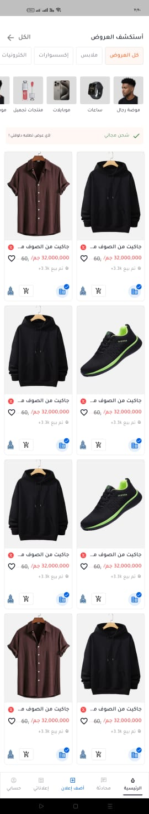
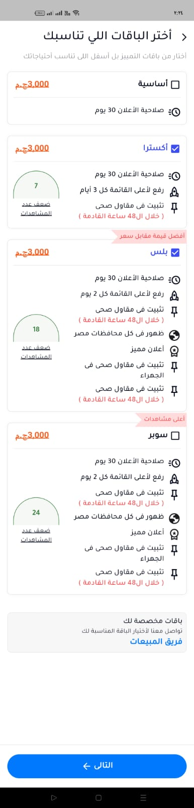
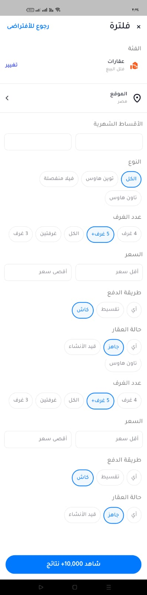
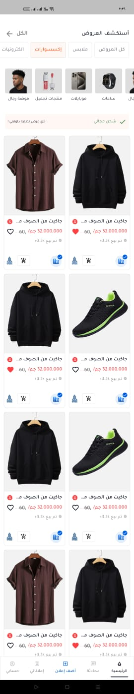
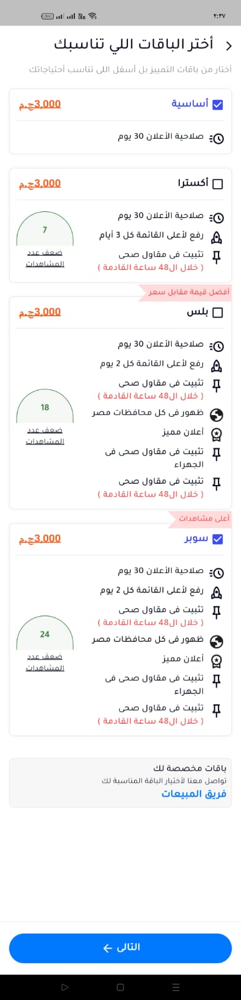
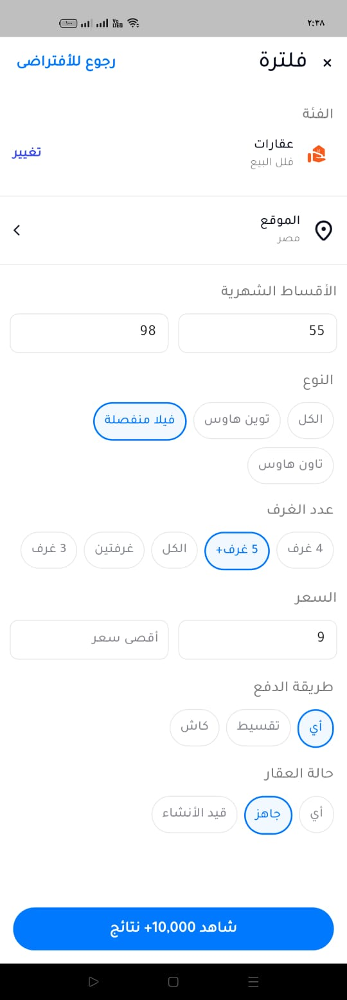

# IT Legend Task

📱 **Flutter Task Project**
- This project was developed as part of a technical evaluation task for IT Legend, aimed at assessing my Flutter development skills and overall readiness for the position.

## Getting Started

**[`📦 Download APK & 🎥 Screen Recording`](https://drive.google.com/drive/folders/1AK4rk9vd9VAoY3v2NVbbOZKQCbHiR4Ua?usp=sharing)**

Here is a Google Drive folder that contains:
- ✅ A **release APK** of the application.
- 🎥 A **screen recording video** demonstrating the app functionality.
- ✅ The application is **fully responsive** and works seamlessly across all mobile screen sizes.

Let me know if you need anything else.

### 🧱 Project Architecture & Technical Overview

- Database: **`SQLite`** using the sqflite Flutter package.

- State Management: **`Cubit`** (flutter_bloc).

- Architecture Pattern: **`MVVM`** (Model–View–ViewModel).

- Design Principles: Applied the **`Single Responsibility Principle`** for clean separation of concerns.

- **Dependency Injection**: Implemented using the get_it package to create singletons.

- **Repository Pattern**: Used to handle data access and business logic separation.

- **Clean Code Practices**: Structured, modular, and maintainable codebase following best practices.

- Navigation: Managed using a dedicated **`router`** for consistent and scalable navigation flow.

**`All user interactions—such as adding favorites, cart items, or selections—are persistently stored in the local SQLite database using the sqflite package.`**

## 📸 Screenshot to App

  
  
  

  
  
  

